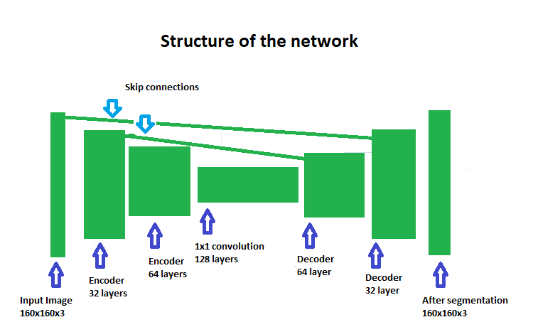

# Deep Learning Project #

The scope of the project is to create a fully convoluitonal neural network that will be able to identify a target from a drona camera feed in simulator environment.

The implemented with Tensorflow and Keras, and was trained on an AWS instance provided by Udacity for this project.
   

## Architecture

Fully convoluitonal neural networks have the following components:

* Encoder
* 1x1 Convolution layer 
* Decoder
* Skipped connections (optional)

#### Encoder
The encoder section is formed of one or more encoder blocks with each including a separable layer.

Each layer captures more and more complex features of the data. However as more layers are used the computational time increases so the number of layers has to be balanced with computational cost in mind. 

#### 1x1 Convolution layer

With a 1x1 convolution layers the data can be both flattened for classification while retaining spatial information.

#### Decoder

The decoder is also comprised of multiple layers. Each layer reconstructs more from the spacial resolution before it. The final layer outputs an image the same size as the original where each pixel is shown in the corresponding segmentation color.
 
#### Skip Connections

The skip connections is allow the information to retained that would be lost in subsequent convolution layers.

### Model Used

Fully convoluitonal neural network used contains:
- Two encoder block layers, 
- A 1x1 convolution layer, 
- Two decoder block layers.

#### 1st convolution 
* filter size of 32 and a stride of 2, same padding
* reduces image to half of original size 

#### 2nd convolution 
* filter size of 64 and a stride of 2, same padding
* reduces image to half of original size

#### 1x1 convolution
* filter size of 128 and stride of 1
 
 Both convolutions used same padding. The padding and the stride of 2 cause each layer to halve the image size, while increasing the depth to match the filter size used, finally encoding the input within the 1x1 convolution layer uses a filter size of 128, with the standard kernel and stride size of 1.

#### 1st decoder block
 
* uses the output from the 1x1 convolution as the small input layer, 
* uses the first convolution layer as the large input layer, thus mimicking a skip connection. 
* A filter size of 64 is used for this layer.

### 2nd decoder block layer 
* uses the output from the first decoder block as the small input layer, 
* uses the original image as the large input layer, mimicking the skip connection to better retain information through the network.
 
#### Output layer
* applies a softmax activation function to the output of the second decoder.

## Hyperparameters

Based on a lot of time (and hopefully not a to large bill) running the combinations on the AWS instance:

* learning rate = 0.002
* batch size = 100
* number of epochs = 40
* steps per epoch = 200
* validation steps = 50
* workers = 2

Tuning the hyperparameters is about balancing the accuracy of the trained model, time used for training, and costs of training the model.

The learning rate defines the magnitude of the steps taken when gradient descent is done. The larger the learning rate the bigger steps are taken.
A large learning rate results in a faster training process but may result in the model getting stuck in a local minimum. Generally decreasing the learning rate result in better training of the model but it increases training time.

The number of epochs is the number of training cycles the model goes through. Increasing it too much may result in the model owerfitting to the data.

Validation steps are used for testing the performance of the model based on data that is not in the training set.

Batch size determines how much training data is used for an epoch. Increasing it may improve the model but if the data is more then what can be fitted into memory as far as I understand swapping may occur and reduce the life of the HDD.

Workers specifies the number of processes used for the training process.

The parameters where set based of Slack discussions and a lot of trial and error. If training the model took to long the AWS instance had a tendency to crash (about 2 out of 5 every runs it crashed for me). 
It is a satisfying feeling to have a computer sweating to do work for you while you go about taking care of all the thing on you To Do (sometime) list.           
## Training

The instance provided by Udacity was used (AWS EC2 p2.xlarge instance, Nvidia K80 GPU, 4 vCPUs, 61 GB RAM). I wish I had one of these for gaming :)

## Performance

The final score of my model is 0.4098, while the final IoU is 0.5123.

## Future Enhancements

The model could be used/trained to identify any solid object that does not cover too much of input image. The hard part would be to find/generate good learning data.

To be hones:
This project was a kind of baptism by fire for me regarding deep learning. If it is accepted I will probably not touch it for very long time. Deep learning peaked my interest but I really need to learn the math and the background details before I would voluntarily mess with this model again.

I will probably get back to real machine learning after I beat this game. I am obsessed with it now.

https://store.steampowered.com/app/619150/while_True_learn/

